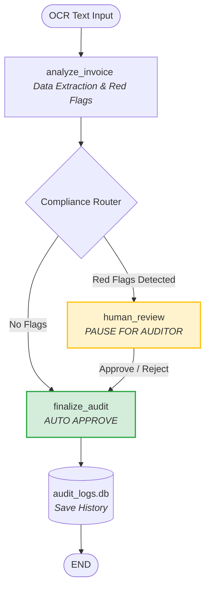

# AI Expense Compliance Auditor

An enterprise-grade **Human-in-the-Loop (HITL)** AI agent for automated corporate expense auditing and compliance checking. Built with **LangGraph** and **LLaMA 3.3** via **GROQ**, this system intelligently detects policy violations in expense reports and routes suspicious invoices to human auditors for final approval.

---

## ✨ Features

- **📋 Smart Invoice Extraction**: Automatically parses OCR invoice text and extracts vendor, date, amount, and category using LLM.
- **🚩 Compliance Rule Engine**: Detects policy violations including:
  - Alcohol on receipt (non-reimbursable)
  - Weekend or late-night expenses
  - High-amount expenses (≥ 50,000 HUF)
- **🤖 Human-in-the-Loop**: Suspends workflow at review checkpoints; auditors approve or reject with reasons.
- **⚡ Fast LLM Inference**: Powered by GROQ's free-tier LLaMA 3.3 70B model (~500ms per invoice).
- **📊 Streamlit UI**: Simple, interactive interface for auditors to review and decide on flagged invoices.
- **🔄 Stateful Workflow**: LangGraph manages the entire audit pipeline with clear state transitions.

---

## 🚀 Quick Start

### 1. Prerequisites

- **Python 3.11+**
- **Poetry** (for dependency management)
- **GROQ API Key** (free tier available)

### 2. Get Your GROQ API Key

1. Go to [console.groq.com](https://console.groq.com)
2. Sign up (free) with your email or GitHub account
3. Navigate to **API Keys** in your dashboard
4. Create a new API key and copy it

### 3. Clone & Setup

```bash
git clone https://github.com/esztertolm/ai-expense-compliance.git
cd ai-expense-compliance
```

### 4. Configure Environment

Create a `.env` file in the project root:

```bash
# .env
GROQ_API_KEY=your-api-key-here
```

### 5. Install Dependencies with Poetry

```bash
poetry install
```

### 6. Run the App

```bash
poetry run streamlit run app.py
```

The UI will open at `http://localhost:8501`.

---

## 📖 How It Works

### Workflow (LangGraph)



### Example Invoice

**Input:**
```
Company: Luxury Restaurant, Date: 2026.07.03 (Friday) 23:45
Amount: 120,000 HUF, Item: 2 x Ribeye steak, 1 bottle of premium wine
```

**Red Flags:**
- Alcohol detected
- Late-night expense
- High amount (≥ 50k)

**UI shows:** Three warnings + [Approve] / [Reject] buttons

---

## 🛠 Project Structure

```
ai-expense-compliance/
├── src/
│   ├── expense_audit.py       # LangGraph workflow, state, nodes
│   └── db.py                  # SQLite persistence for audit history
├── tests/
│   └── test_workflow.py       # Unit tests
├── app.py                     # Streamlit UI
├── config.yaml                # Sample invoice scenarios and defaults
├── audit_logs.db              # Local SQLite database used for audit history
├── .env                       # Environment variables (API keys)
├── pyproject.toml             # Poetry config
└── README.md                  # This file
```

## 🗄️ Data Persistence & Audit Trail

- The application stores finalized audit results in a local SQLite database file named `audit_logs.db`.
- Audit history is displayed in the History tab and includes the timestamp, vendor, amount, status, and manager notes.
- In the current implementation, audit entries are not designed to be deleted from the UI or workflow, which helps preserve a durable and reviewable trail for compliance purposes.

---

## 🔐 Architecture Highlights

- **LangGraph**: Manages workflow state machine with human interrupts
- **Pydantic**: Enforces structured LLM output (invoice schema)
- **LangChain**: Chains LLM → parser → business logic
- **GROQ**: Free LLM API (~500ms latency, developer free tier availabl)
- **Streamlit**: Real-time UI with button-based human input


